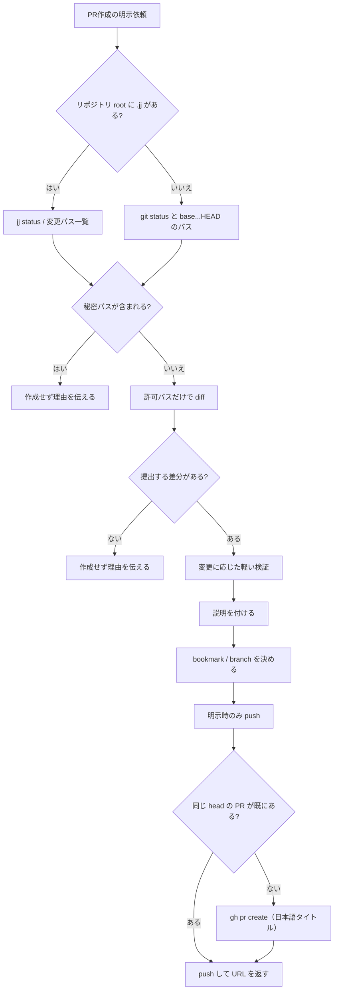
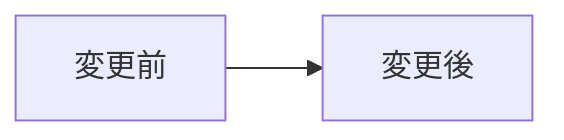

# 安価なPR作成

PR作成を、余計な高価モデル呼び出しなしで実行する。対象は **作成（必要なら push）まで**。
Pi では `/skill:cheap-pr` で明示呼び出しもできる。

## いつ使う

ユーザーが当該ターンで PR の作成・提出を明示したときだけ使う。

- 「PRだして」「PR出して」「PR作って」
- 「pull requestを作成」「プルリク作成」「open a PR」

**使わない**（別 skill / 別依頼）:

- レビュー、レビュー指摘への対応、コメント返信
- merge、bookmark/branch 削除、force-push（明示依頼がない限り）

## モデル方針

- PR作成だけなら、追加の高価モデル（`fugu-ultra` / Opus / Cursor など）へ委譲しない。
- Pi では `auto-fugu-model` の create-pr 判定で `fugu` に寄せる。既に高価モデルでターンが始まっている場合は、そのターンでは CLI と既存情報中心で進め、追加の LLM サブタスクを増やさない。
- 長い説明の下書きを別モデルに投げない。差分から自分で短くまとめる。

## 流れ



## 実行手順

1. **変更パスだけ先に取る**
   - `.jj` がある場合は `git` ではなく `jj` を使う。`jj` ではエディタが起動し得る操作に `JJ_EDITOR=true` を付ける。
   - **全文 diff を先に生成してはいけない**。内容を読まず、変更パス一覧だけ取る。
   - jj: `jj status` や `jj diff --name-only`。必要なら `jj log -r @`（メッセージのみ）。
   - git: `git status --porcelain` に加え、デフォルトブランチ（`gh repo view --json defaultBranchRef --jq .defaultBranchRef.name`）との `git diff --name-only <base>...HEAD` も取る。staged は porcelain の index 状態で拾う。
2. **秘密パスがあれば中止**
   - `.env`, `.env*`, `.envrc`, `.envrc.local`, `credentials*`, `secrets*`, `*.pem`, `*.key`, `id_rsa`, `id_ed25519` などは読まない。
   - 上の一覧に秘密パスが1つでも含まれるなら、**diff を取らず PR を作らない**。該当パスを伝えて止める。
   - 含まれなければ許可パスだけを diff コマンドに渡し、その内容だけを読む。
     - jj: `jj diff -- <paths>`
     - git: unstaged は `git diff -- <paths>`、staged は `git diff --cached -- <paths>`、積み済みコミットは `git diff <base>...HEAD -- <paths>`
3. **差分が空なら中止**
   - 許可パスの提出対象が無ければ PR を作らず、その旨を伝える。
   - git では `git diff` （unstaged）だけ見ない。staged（`git diff --cached`）とデフォルトブランチ以降のコミット（`git diff <base>...HEAD` / `git log <base>..HEAD`）も空のときだけ中止する。
4. **最小検証**
   - 変更内容に応じた軽い検証だけ実行する（関連 lint / 関連テスト）。
   - 大きなテストスイートや外部サービス呼び出しは、ユーザーが明示しない限り省く。
5. **リビジョン / コミット説明**
   - jj: `JJ_EDITOR=true jj describe -m "..."`。
   - git: 未コミットがあれば、PR 作成依頼の一環としてコミットする。
   - 説明は短く、変更の「なぜ」を書く。ファイル名の羅列はしない。
6. **bookmark / branch**
   - **1 bookmark = 1 PR**。PR を分けない限り bookmark を増やさない。
   - ユーザー指定がなければ変更内容から短い名前を作る。例: `chore/pi-token-controls`。
   - jj: `jj bookmark create <name> -r @`。既存なら `jj bookmark set <name> -r @`。
   - git: 現在が `main` / デフォルトブランチなら同名の topic branch を切ってから進める。
   - `main`（デフォルトブランチ）への push はしない。
7. **push**
   - ユーザーが PR 作成を明示している場合のみ push する。
   - jj: `jj git push --bookmark <name>`（引数なしの `jj git push` は使わない）。
   - git: `git push -u origin HEAD`。
   - force-push は明示依頼がある場合だけ。失敗したら理由を伝え、勝手に `--force` しない。
8. **PR作成**
   - 同じ head の PR が既にあれば新規作成せず、push 結果と既存 URL を返す。
   - 無ければ作成する。`--base` は省略し、リポジトリのデフォルトブランチに任せる。

```bash
gh pr create --head <name> --title "..." --body "$(cat <<'EOF'
...
EOF
)"
```

完了時は PR URL を返す。

## タイトルと本文

### タイトル

**日本語の1行**にする。変更の「なぜ」を先に書く。ファイル名や英語だけの要約にしない。

- よい: `pi のトークン制御を追加する`
- よい: `cheap-pr の手順を日本語タイトルと本文テンプレに揃える`
- だめ: `Update SKILL.md`
- だめ: `fix stuff`

conventional prefix（`feat:` / `fix:` / `chore:`）は必須ではない。付けるなら prefix だけ英語、その後は日本語。

### 本文

差分を読んだ人が、レビューなしでも「何が・なぜ変わったか」を追える長さにする。単純な修正なら短くてよい。流れ・構成・状態遷移が変わるときだけ mermaid を使う。

```markdown
## 概要
- なぜこの変更が必要か
- 何が変わるか（1〜3点）

## 変更内容
（流れが変わるときだけ mermaid を置く。単純な修正では省略）
- 主要なタッチポイント（ファイルや責務が複数あるとき）

## 確認
- [ ] 実行した軽い検証と結果
- [ ] 実行していないこと（大きなテストを省いた等）
```

mermaid を使うときの例（`## 変更内容` の中に置く）:



**本文に書かない**:

- レビュー指摘、リスク判定、レビュアーへの依頼
- レビュー後の対応予定、残課題としての review follow-up
- 秘密値、ローカルパス、一時ファイルの中身

## 注意

- PR作成は外部送信なので、ユーザーが「PRだして」等で明示したときだけ実行する。
- merge / bookmark 削除 / branch 削除 / force-push は、ユーザーが明示したときだけ実行する。
- 既存リビジョンを書き換えて push 済み履歴と食い違う場合は、勝手に force-push せず状況を伝える。
